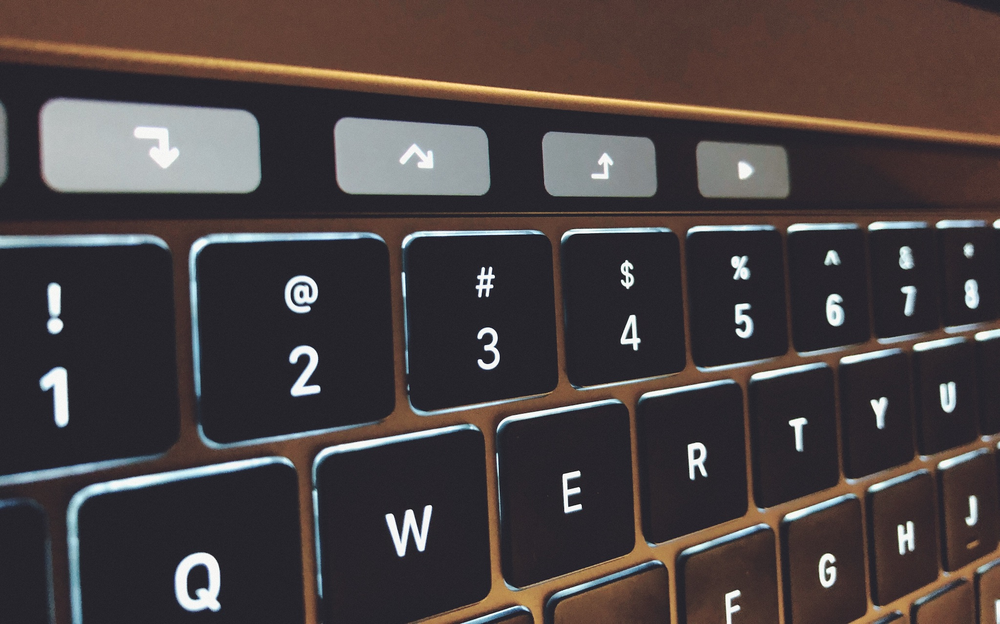
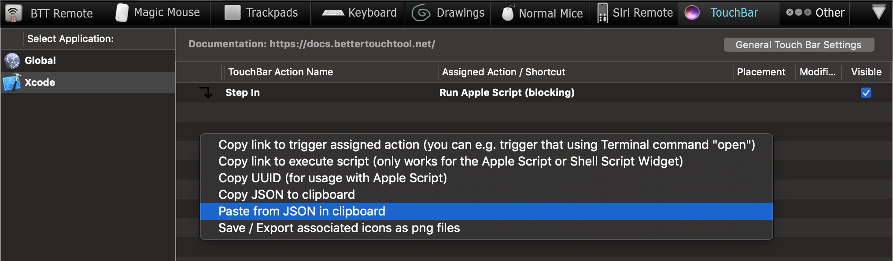

## btt-xcode
XCode debugger commands for BetterTouchTool

The BTT presets adds the following button in the XCode touch bar 

- Step in
-  Step over
- Step out
- Continue

### Installation

- Install [BetterTouchTool](https://folivora.ai/)

- Open the BTT `Preferences > TouchBar > Manage  Presets > Import` and import the `btt-xcode.bttpreset`

You can also import individual [buttons](buttons) into an existing present by copying their JSON and pasting it in 

### Development

The buttons are very simple AppleScripts that call the XCode menu items. The source of the AppleScript is in [scripts](scripts) folder.

## Credits
[Material Design icons by Google](https://github.com/google/material-design-icons)

## Links

[BTT forums](https://community.folivora.ai)

